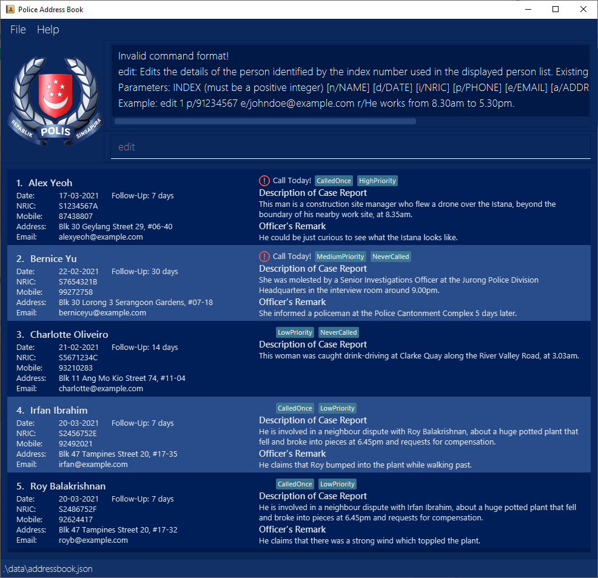

* This is an **Addressbook NS Edition (ABNS)**. 
  * for the Singapore Armed Forces (SAF).
  * to include more information of the soldier such as rank, group, and performance.
  * to manage records as a bulk without the hassle of editing records one by one.
* The software of project is evolved from a desktop application (called _AddressBook_) used for managing contact details.
  * It is **written in OOP fashion**. 
  * Using **Java with JDK 11**.
  * Using **Gradle** as automating build tool.
  * Use **GitHub Actions** to set up **Continuous Integration (CI)**.
* It is named `Army Management System`.
* For the detailed documentation of this project, see the **[Addressbook NS Edition (ABNS) Website](https://ay2021s2-tic4002-f18-3.github.io/tp2)**.
* This project is based on the AddressBook-Level3 project created by the [SE-EDU initiative](https://se-education.org).
