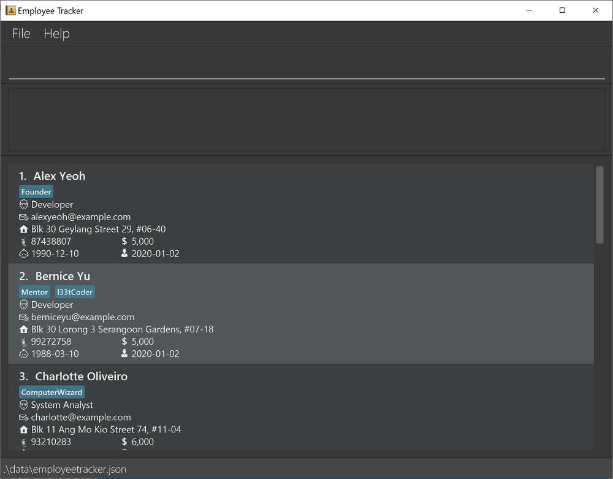

* This is **a project for TIC4002 students**.
* This project is based on the AddressBook-Level3 project created by the **[SE-EDU initiative](https://se-education.org)**.
* The project simulates a brownfield team project by using the existing AddressBook-Level3 codebase as a platform to develop **Employee Tracker**.
  * It is **written in OOP fashion**.
  * It comes with a **reasonable level of user and developer documentation**.
* For the detailed documentation of this project, see the **[Employee Tracker Product Website](https://ay2021s2-tic4002-f18-2.github.io/tp2/)**.
