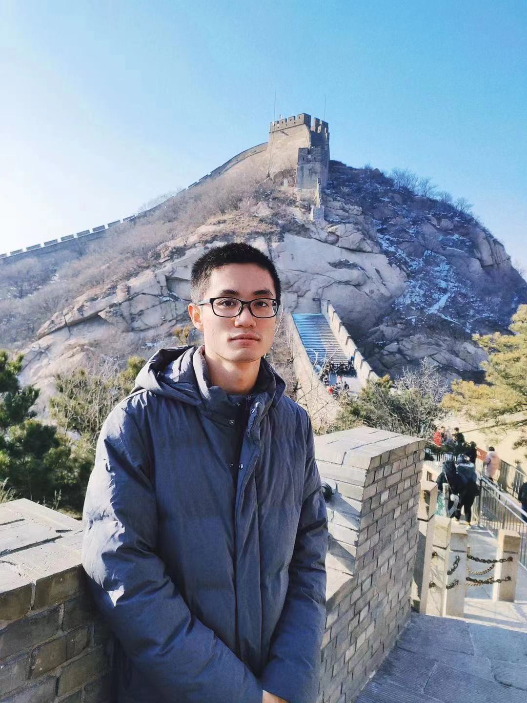

We are a team based in the [School of Continuing And Lifelong Education, National University of Singapore](https://scale.nus.edu.sg/).

## Project team

### Hong Jian Cheng

[[github](https://github.com/HongJiancheng)]
[[portfolio](team/hongJiancheng.md)]

You can reach me at the email `e0264456@u.nus.edu`

* Role: Project Advisor
* Responsibilities: UI

### Tay Jun Wen

[[github](https://github.com/tototto)]
[[portfolio](team/tototto.md)]

You can reach me at the email `junwen.tay@u.nus.edu`

* Role: Team Lead
* Responsibilities: UI

### Januarius Jang

[[github](https://github.com/JanuariusJang)] 
[[portfolio](team/JanuariusJang.md)]

You can reach me at the email `e0261976@u.nus.edu`

* Role: Developer
* Responsibilities: Data

### Zheng Shi Jie

[[github](https://github.com/ZhengShijieNUS)]
[[portfolio](team/zhengshijienus.md)]

You can reach me at the email `e0263963@u.nus.edu`

* Role: Developer
* Responsibilities: Dev Ops + Threading

