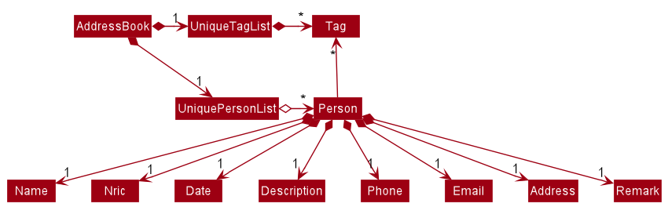
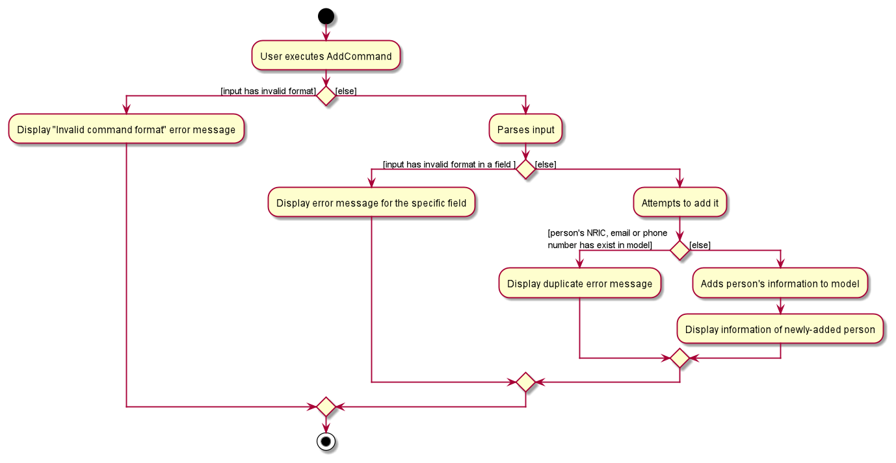
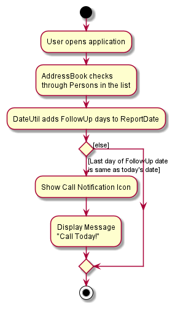

* Table of Contents
{:toc}

--------------------------------------------------------------------------------------------------------------------

## **Setting up, getting started**

Refer to the guide [_Setting up and getting started_](SettingUp.md).

--------------------------------------------------------------------------------------------------------------------

## **Design**

### Architecture

The ***Architecture Diagram*** given above explains the high-level design of the App. Given below is a quick overview of each component.

:bulb: **Tip:** The `.puml` files used to create diagrams in this document can be found in the [diagrams](https://github.com/AY2021S2-TIC4002-F18-1/tp2/tree/master/docs/diagrams/) folder. Refer to the [_PlantUML Tutorial_ at se-edu/guides](https://se-education.org/guides/tutorials/plantUml.html) to learn how to create and edit diagrams.

**`Main`** has two classes called [`Main`](https://github.com/AY2021S2-TIC4002-F18-1/tp2/tree/master/src/main/java/seedu/address/Main.java) and [`MainApp`](https://github.com/AY2021S2-TIC4002-F18-1/tp2/tree/master/src/main/java/seedu/address/MainApp.java). It is responsible for,
* At app launch: Initializes the components in the correct sequence, and connects them up with each other.
* At shut down: Shuts down the components and invokes cleanup methods where necessary.

[**`Commons`**](#common-classes) represents a collection of classes used by multiple other components.

The rest of the App consists of four components.

* [**`UI`**](#ui-component) The UI of the App.
* [**`Logic`**](#logic-component) The command executor.
* [**`Model`**](#model-component) Holds the data of the App in memory.
* [**`Storage`**](#storage-component) Reads data from, and writes data to, the hard disk.

Each of the four components,

* defines its *API* in an `interface` with the same name as the Component.
* exposes its functionality using a concrete `{Component Name}Manager` class which implements the corresponding API `interface` mentioned in the previous point.

For example, the `Logic` component (see the class diagram given below) defines its API in the `Logic.java` interface and exposes its functionality using the `LogicManager.java` class which implements the `Logic` interface.

**How the architecture components interact with each other**

The *Sequence Diagrams* below show how the components interact with each other for the scenario where the user issues the command `delete 1`.

The sections below give more details of each component.

### UI component

**API** :
[`Ui.java`](https://github.com/AY2021S2-TIC4002-F18-1/tp2/tree/master/src/main/java/seedu/address/ui/Ui.java)

The UI consists of a `MainWindow` that is made up of parts e.g.`CommandBox`, `ResultDisplay`, `PersonListPanel`, `StatusBarFooter` etc. All these, including the `MainWindow`, inherit from the abstract `UiPart` class.

The `UI` component uses JavaFx UI framework. The layout of these UI parts are defined in matching `.fxml` files that are in the `src/main/resources/view` folder. For example, the layout of the [`MainWindow`](https://github.com/AY2021S2-TIC4002-F18-1/tp2/tree/master/src/main/java/seedu/address/ui/MainWindow.java) is specified in [`MainWindow.fxml`](https://github.com/AY2021S2-TIC4002-F18-1/tp2/tree/master/src/main/resources/view/MainWindow.fxml)

The `UI` component,

* Executes user commands using the `Logic` component.
* Listens for changes to `Model` data so that the UI can be updated with the modified data.

### Logic component

**API** :
[`Logic.java`](https://github.com/AY2021S2-TIC4002-F18-1/tp2/tree/master/src/main/java/seedu/address/logic/Logic.java)

1. `Logic` uses the `AddressBookParser` class to parse the user command.
1. This results in a `Command` object which is executed by the `LogicManager`.
1. The command execution can affect the `Model` (e.g. adding a person).
1. The result of the command execution is encapsulated as a `CommandResult` object which is passed back to the `Ui`.
1. In addition, the `CommandResult` object can also instruct the `Ui` to perform certain actions, such as displaying help to the user.

Given below is the Sequence Diagram for interactions within the `Logic` component for the `execute("delete 1")` API call.

:information_source: **Note:** The lifeline for `DeleteCommandParser` should end at the destroy marker (X) but due to a limitation of PlantUML, the lifeline reaches the end of diagram.

### Model component

**API** : [`Model.java`](https://github.com/AY2021S2-TIC4002-F18-1/tp2/tree/master/src/main/java/seedu/address/model/Model.java)

The `Model`,

* stores a `UserPref` object that represents the user’s preferences.
* stores the address book data.
* exposes an unmodifiable `ObservableList<Person>` that can be 'observed' e.g. the UI can be bound to this list so that the UI automatically updates when the data in the list change.
* does not depend on any of the other three components.

:information_source: **Note:** An example of alternative (arguably, a more OOP) model is given below. It has a `Tag` list in the `AddressBook`, which `Person` references. This allows `AddressBook` to only require one `Tag` object per unique `Tag`, instead of each `Person` needing their own `Tag` object. 

### Storage component

**API** : [`Storage.java`](https://github.com/AY2021S2-TIC4002-F18-1/tp2/tree/master/src/main/java/seedu/address/storage/Storage.java)

The `Storage` component,
* can save `UserPref` objects in json format and read it back.
* can save the address book data in json format and read it back.

### Common classes

Classes used by multiple components are in the `seedu.addressbook.commons` package.

--------------------------------------------------------------------------------------------------------------------

## **Implementation**
This section describes some noteworthy details on how certain features are implemented.
### Add feature
The `AddCommand` feature allows the user to add a new person and save it to the address book.
#### Implementation
Given below is the Sequence Diagram for interactions within the `Logic` component for the `execute("add n/John Doe d/22-02-2021 i/S2731125H p/98765432 e/johnd@example.com a/311, Clementi Ave 2, #02-25 de/This man stole 3 times r/shop theft t/NeverCalled")` API call.

:information_source: **Note:** The lifeline for `AddCommandParser` should end at the destroy marker (X) but due to a limitation of PlantUML, the lifeline reaches the end of diagram.

 
The following activity diagram summarizes what happens when a user executes addCommand feature:

The `add` command facilitated by `AddClaimCommand`which extends the `Command` class and the `AddCommandParser` class, which implements the `Parser` class.
This operation takes in a String input from the user that will create `Person` objects based on the following prefixes and parameters:
n/`name`, d/`date`, f/`followUp`, i/`nric`, p/`phone`, e/`email`, a/`address` , de/`description` , r/`remark` , t/`tag`.  
Meanwhile, the r/`remark` and t/`tag` are not compulsory to include.
A regex validation check will be imposed upon the creation. Any checks that fails the validation would display an error message to guide the user.
Parameters will be checked whether they are valid:
* `name` uses `Name#isValidName()` to ensure that name only contain alphanumeric characters and spaces, and it should not be blank.
* `nric` uses `Nric#isValidNric()` to ensure that nric only contain a capital letter,it should start with S, T, F or G,followed by 7 numerical numbers and a capital letter with alphabetical character. It should not be blank.
* `date` uses `Date#isValidDate()` to ensure that date should follow date format 'dd-mm-yyyy', and it should be a valid calendar date.
* `phone` uses `Phone#isValidPhone()` to ensure that phone numbers should only contain numbers, and it should be 3-15 digits long.
* `email` uses `Email#isValidEmail()` to ensure correct email format.
* `followUp` uses `FollowUp#isValidFollowUp()` to ensure that FollowUp should only contain positive integers, and it should not be blank.

Upon receiving a user command that has `add` as the first word, the following object interactions will occur, resulting in the instantiation of an `AddCommand` object:

1. `MainWindow` object calls `LogicManager#execute(input)`, where `input` is the user's input string;

2. `LogicManager` object calls `AddressBookParser#parseCommand(commandText)` to parse the user command, where `commandText` is the user's input string;

3. `AddressBookParser#parseCommand()` calls `AddCommandParser#parse(arguments)`, where `arguments` are the parameters in `commandText` such as `i/NRIC`;
In this case, `AddClaimCommandParser#parse()`is being created, and the user's input will be passed in as a parameter.

4. `AddCommandParser#parse()` will do a validation check on the user's input before creating and returning a`AddCommand` object with `Person` as its attribute.calls 

Next, the following object interactions will occur to save the new person information to the `Model` object;

1. `LogicManager` object calls `AddCommand#execute(model)`, where `model` is the `Model` object and checking whether there is an existing Person

2. `AddCommand#execute()` calls `Model#addPerson(toAdd)` to add the new `Person`, where `toAdd` is the `Person` object to be stored.
It will return a `CommandResult` to the `LogicManager` that will return to user.

### Follow-up Calls feature

#### Implementation

This feature is meant to assist the Investigations Officer by reminding which persons are to be called up on the day itself, by showing a notification icon and a message.

The following activity diagram summarizes what happens when a user opens the application:

The following activity diagram summarizes what happens when a user executes a new command:

### Add/Remove Tag feature

This feature provides an alternative way for the uer to add/remove a specified tag.
The Edit tag feature `edit t/[Tag]` will overwrite the entire set of tags. 
In other words, if there are few tags, and user only wants to update a specified tag, the user will need to re-enter all the tags in the `edit t/[Tag]` command, which is tedious and time-consuming.
With the `Add/Remove Tag feature`, the user will be able to remove a specified tag and add in a new tag, or just simply add in a new tag directly.

#### Implementation

Given below is the Sequence Diagram for interactions within the `Logic` component for the `execute("addTag 1 at/CalledOnce") and execute("removeTag 1 at/CalledOnce")` API call.

:information_source: **Note:** The lifeline for `AddTagCommandParser` should end at the destroy marker (X) but due to a limitation of PlantUML, the lifeline reaches the end of diagram.

 

#### Design consideration:

##### Aspect: How add command executes
* **Alternative 1 (current choice):** unique NRIC, phone number or email to the entire address book.
  * Pros: Since each person have unique NRIC, phone number or email, it can easily be retrieved from `UniquePersonList`.
  This will reduce coupling when the person is to be updated.
  * Cons: Every time we retrieve a person using its `Nric`,`phone number` or `email`, we have to search through the whole `UniquePersonList` to find
          the associated person. As the list gets bigger, this may take more time.
          
* **Alternative 2 :** unique name to the entire address book
  * Pros: Since each person have unique name, it can easily be retrieved from `UniquePersonList`.
  * Cons: There may be a person that have the same name in the world.Therefore, it will have "fake" duplicate issue.

   
  We have decided to opt for the first option primarily because it reduces the number of potential bugs such as "fake" duplication issue 
  and the complexities involved. Moreover, the implementation is still fast enough for small-scale organisations to pick up our app and use it, minimising the cons.
  
##### Aspect: How delete command executes
* **Alternative 1 (current choice):** deleting by index
  * Pros: Since each person's information has a unique index, any deletion by the index is less prone to bugs and easier to implement.
  * Cons: User will have to scroll the list for the data entry and look for its index which can be inconvenient.
          
* **Alternative 2 :** deleting by NRIC
  * Pros: Since each person have unique NRIC, any deletion by the NRIC is less prone to bugs.
  * Cons: User will need to remember the specific person's NRIC, it is very inconvenient to user.

   
  We have decided to opt for the first option primarily because it is more convenient to the user as compare to alternative 2. 
_{more aspects and alternatives to be added}_

--------------------------------------------------------------------------------------------------------------------

## **Documentation, logging, testing, configuration, dev-ops**

* [Documentation guide](Documentation.md)
* [Testing guide](Testing.md)
* [Logging guide](Logging.md)
* [Configuration guide](Configuration.md)
* [DevOps guide](DevOps.md)

--------------------------------------------------------------------------------------------------------------------

## **Appendix: Requirements**

### Product scope

**Target user profile**: Police Investigation Officer

* has a need to record contact details, case description and report number
* prefer desktop apps over other types
* can type fast
* prefers typing to mouse interactions
* is reasonably comfortable using CLI apps

**Value proposition**: Helps to remind which people to call, helps to auto reschedule follow-up calls, able to update a person's information and add own notes after a call.

### User stories

Priorities: High (must have) - `* * *`, Medium (nice to have) - `* *`, Low (unlikely to have) - `*`

| Priority | As a …​                                    | I want to …​                     | So that I can…​                                                        |
| -------- | ------------------------------------------ | ------------------------------ | ---------------------------------------------------------------------- |
| `* * *`  | new user | see usage instructions         | refer to instructions when I forget how to use the App                 |
| `* * *`  | user | add a new person               | record new cases                                                                       |
| `* * *`  | user | delete a person                | remove entries that I no longer need                                   |
| `* * *`  | user | list all person's information          | view all my person's information|
| `* * *`  | police officer | edit a person's information        | modify a person's information|
| `* * *`  | police officer | clear all person's information       | start afresh with the app|
| `* * *`  | police officer | have an NRIC field         | easily find the unique person |
| `* * *`  | police officer | add remarks to a case         | record my own notes after a call |
| `* * *`  | police officer | find a person by field         | easily locate details of persons with any bit of information I can remember |
| `* * *`  | police officer | have a date for each case         | know when the case occurred |
| `* * *`  | police officer | have a description for each case      | see the details of the person and the case for follow up in future |
| `* * *`  | police officer | set follow-up           | be reminded to give a follow-up call |
| `* *`  | police officer | have no repeated data           | avoid duplicate entries (check by phone number or NRIC) |
| `* *`  | police officer | have an email field           | still contact the person in another way in case no one answers the phone |
| `*`    | police officer | have a better GUI display of information           | easily see the details of each person and their case |

### Use cases

(For all use cases below, the **System** is the `Police Address Book` and the **Actor** is the `user`, unless specified otherwise)

**Use case: Add a person**

1.  User attempts to add a person
2.  Police Address Book adds the person
3.  Police Address Book shows the new person in the list

    Use case ends.

**Extensions**

* 1a. There are missing fields.

    * 1a1. Police Address Book shows an error message and an example.

      Use case resumes at step 1.
    
* 2a. There are duplicate entries.

    * 2a1. Police Address Book shows an error message.

      Use case resumes at step 1.

**Use case: Find a person**

1.  User find a person by field
2.  Police Address Book shows a list of matching persons

    Use case ends.

**Extensions**

* 2a. The list is empty.

  Use case ends.

* 2b. There are no matching results.

    * 2b1. Police Address Book shows nothing.

      Use case resumes at step 1.
    
* 2c. The given field is invalid.

    * 2b1. Police Address Book shows an error message.

      Use case resumes at step 1.

**Use case: Delete a person**

1.  User requests to list persons
2.  Police Address Book shows a list of persons
3.  User requests to delete a specific person in the list
4.  Police Address Book deletes the person

    Use case ends.

**Extensions**

* 2a. The list is empty.

  Use case ends.

* 3a. The given index is invalid.

    * 3a1. Police Address Book shows an error message.

      Use case resumes at step 2.

**Use case: Edit a person**

1.  User requests to list persons
2.  Police Address Book shows a list of persons
3.  User requests to edit a specific person in the list
4.  Police Address Book update the person's information

    Use case ends.

**Extensions**

* 2a. The list is empty.

  Use case ends.

* 3a. The given index is invalid.

    * 3a1. Police Address Book shows an error message.

      Use case resumes at step 2.
      
**Use case: Send email to person**

1.  User requests to list persons
2.  Police Address Book shows a list of persons
3.  User requests to send a specific email address to specific person in the list
4.  Police Address Book will show a response message

    Use case ends.

**Extensions**

* 2a. The list is empty.

  Use case ends.

* 3a. The given index is invalid.

    * 3a1. Police Address Book shows an error message.

      Use case resumes at step 2.

### Non-Functional Requirements

1.  Should work on any _mainstream OS_ as long as it has Java `11` or above installed.
2.  Should be able to hold up to 1000 persons without a noticeable sluggishness in performance for typical usage.
3.  A user with above average typing speed for regular English text (i.e. not code, not system admin commands) should be able to accomplish most of the tasks faster using commands than using the mouse.
* Operation Environment: Should work on any _Mainstream OS_ as long as it has Java **11** or above installed.
* Usability: A command line interface application, user will use specified command to interact with the system.
* Capacity: Should be able to record at least 1,000 person records.
* Reliability / Availability: Once the Police Address Book has been successfully deployed on user's computer, availability is 24/7.
* Scalability: The current version only supports local data file storage, users are unable to share a centralised project data.
  If the need of having a centralised data storage raised in the future, it can be added as system enhancement.
* Security: User login is not required. Police Address Book uses user's computer login as authentication.
* Maintainability: A updated JAR file will be released to user if there is any update to the current version of the Police Address Book.

### Glossary

* **Mainstream OS**: Windows, Linux, Unix, OS-X

--------------------------------------------------------------------------------------------------------------------

## **Appendix: Instructions for manual testing**

Given below are instructions to test the app manually.

:information_source: **Note:** These instructions only provide a starting point for testers to work on;
testers are expected to do more *exploratory* testing.

### Launch and shutdown

1. Initial launch

   1. Download the jar file and copy into an empty folder

   1. Double-click the jar file Expected: Shows the GUI with a set of sample contacts. The window size may not be optimum.

1. Saving window preferences

   1. Resize the window to an optimum size. Move the window to a different location. Close the window.

   1. Re-launch the app by double-clicking the jar file. 
       Expected: The most recent window size and location is retained.

1. _{ more test cases …​ }_

### Deleting a person

1. Deleting a person while all persons are being shown

   1. Prerequisites: List all persons using the `list` command. Multiple persons in the list.

   1. Test case: `delete 1` 
      Expected: First contact is deleted from the list. Details of the deleted contact shown in the status message. Timestamp in the status bar is updated.

   1. Test case: `delete 0` 
      Expected: No person is deleted. Error details shown in the status message. Status bar remains the same.

   1. Other incorrect delete commands to try: `delete`, `delete x`, `...` (where x is larger than the list size) 
      Expected: Similar to previous.

1. _{ more test cases …​ }_

### Saving data

1. Dealing with missing/corrupted data files

   1. _{explain how to simulate a missing/corrupted file, and the expected behavior}_

1. _{ more test cases …​ }_
