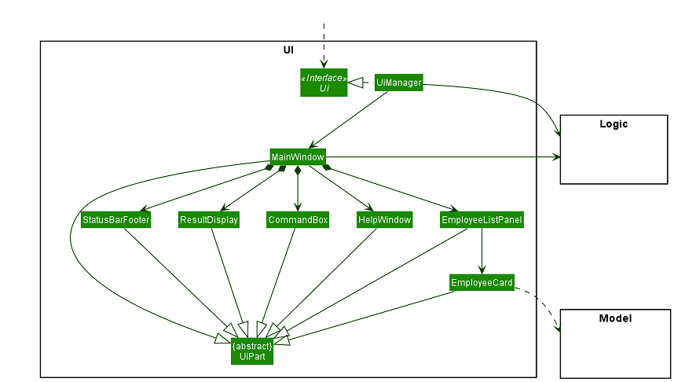
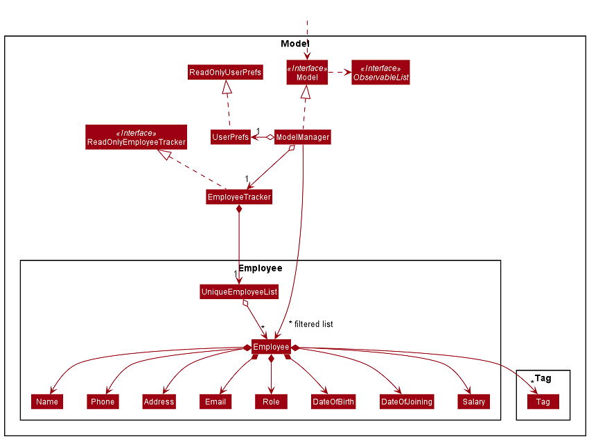
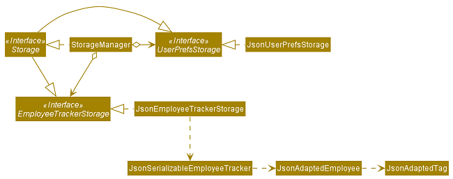
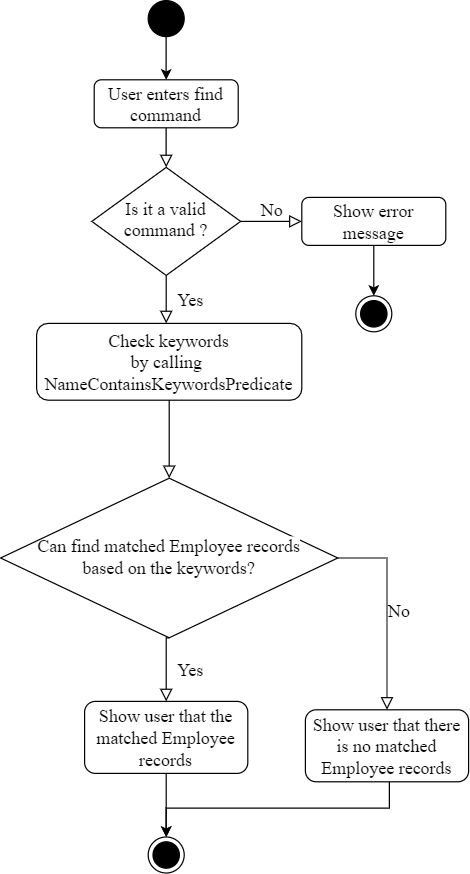

* Table of Contents
{:toc}
--------------------------------------------------------------------------------------------------------------------

## **Design**

### Architecture

The ***Architecture Diagram*** given above explains the high-level design of the App. Given below is a quick overview of each component.

:bulb: **Tip:** The `.puml` files used to create diagrams in this document can be found in the [diagrams](https://github.com/AY2021S2-TIC4002-F18-2/tp2/tree/master/docs/diagrams/) folder. Refer to the [_PlantUML Tutorial_ at se-edu/guides](https://se-education.org/guides/tutorials/plantUml.html) to learn how to create and edit diagrams.

**`Main`** has two classes called [`Main`](https://github.com/AY2021S2-TIC4002-F18-2/tp2/blob/master/src/main/java/employeetracker/Main.java) and [`MainApp`](https://github.com/AY2021S2-TIC4002-F18-2/tp2/blob/master/src/main/java/employeetracker/MainApp.java). It is responsible for,
* At app launch: Initializes the components in the correct sequence, and connects them up with each other.
* At shut down: Shuts down the components and invokes cleanup methods where necessary.

[**`Commons`**](#common-classes) represents a collection of classes used by multiple other components.

The rest of the App consists of four components.

* [**`UI`**](#ui-component): The UI of the App.
* [**`Logic`**](#logic-component): The command executor.
* [**`Model`**](#model-component): Holds the data of the App in memory.
* [**`Storage`**](#storage-component): Reads data from, and writes data to, the hard disk.

Each of the four components,

* defines its *API* in an `interface` with the same name as the Component.
* exposes its functionality using a concrete `{Component Name}Manager` class (which implements the corresponding API `interface` mentioned in the previous point.

For example, the `Logic` component (see the class diagram given below) defines its API in the `Logic.java` interface and exposes its functionality using the `LogicManager.java` class which implements the `Logic` interface.

**How the architecture components interact with each other**

The *Sequence Diagram* below shows how the components interact with each other for the scenario where the user issues the command `delete 1`.

The sections below give more details of each component.

### UI component

**API** :
[`Ui.java`](https://github.com/AY2021S2-TIC4002-F18-2/tp2/blob/master/src/main/java/employeetracker/ui/Ui.java)

The UI consists of a `MainWindow` that is made up of parts e.g.`CommandBox`, `ResultDisplay`, `EmployeeListPanel`, `StatusBarFooter` etc. All these, including the `MainWindow`, inherit from the abstract `UiPart` class.

The `UI` component uses JavaFx UI framework. The layout of these UI parts are defined in matching `.fxml` files that are in the `src/main/resources/view` folder. For example, the layout of the [`MainWindow`](https://github.com/AY2021S2-TIC4002-F18-2/tp2/blob/master/src/main/java/employeetracker/ui/MainWindow.java) is specified in [`MainWindow.fxml`](https://github.com/AY2021S2-TIC4002-F18-2/tp2/blob/master/src/main/resources/view/MainWindow.fxml)

The `UI` component,

* Executes user commands using the `Logic` component.
* Listens for changes to `Model` data so that the UI can be updated with the modified data.

### Logic component

**API** :
[`Logic.java`](https://github.com/AY2021S2-TIC4002-F18-2/tp2/blob/master/src/main/java/employeetracker/logic/Logic.java)

1. `Logic` uses the `EmployeeTrackerParser` class to parse the user command.
1. This results in a `Command` object which is executed by the `LogicManager`.
1. The command execution can affect the `Model` (e.g. adding a employee).
1. The result of the command execution is encapsulated as a `CommandResult` object which is passed back to the `Ui`.
1. In addition, the `CommandResult` object can also instruct the `Ui` to perform certain actions, such as displaying help to the user.

Given below is the Sequence Diagram for interactions within the `Logic` component for the `execute("delete 1")` API call.

:information_source: **Note:** The lifeline for `DeleteCommandParser` should end at the destroy marker (X) but due to a limitation of PlantUML, the lifeline reaches the end of diagram.

### Model component

**API** : [`Model.java`](https://github.com/AY2021S2-TIC4002-F18-2/tp2/blob/master/src/main/java/employeetracker/model/Model.java)

The `Model`,

* stores a `UserPref` object that represents the user’s preferences.
* stores the address book data.
* exposes an unmodifiable `ObservableList<Employee>` that can be 'observed' e.g. the UI can be bound to this list so that the UI automatically updates when the data in the list change.
* does not depend on any of the other three components.

### Storage component

**API** : [`Storage.java`](https://github.com/AY2021S2-TIC4002-F18-2/tp2/blob/master/src/main/java/employeetracker/storage/Storage.java)

The `Storage` component,
* can save `UserPref` objects in json format and read it back.
* can save the Employee Tracker data in json format and read it back.

### Common classes

Classes used by multiple components are in the `employeetracker.commons` package.

--------------------------------------------------------------------------------------------------------------------

## **Implementation**

### Add feature
#### Implementation of add feature

The `add` command is implemented using the `AddCommand` class, which extends the `Command` class; and the `AddCommandParser` class, which implements the `Parser` class. Upon receiving a user command that has `add` as the first word, the following object interactions will occur, resulting in the instantiation of an `AddCommand` object:

1. `MainWindow` object calls `LogicManager#execute(commandText)`, where `commandText` is the user's input string;

2. `LogicManager` object calls `EmployeeTrackerParser#parseCommand(commandText)` to parse the user command, where `commandText` is the user's input string;

3. `EmployeeTrackerParser#parseCommand()` calls AddCommandParser#parse(arguments), where `arguments` are the parameters in `commandText` such as `n/NAME` and `s/SALARY`;

4. AddCommandParser#parse() calls `AddCommand(employee)` to instantiate an `AddCommand` object, where `employee` is an `Employee` object that is constructed using `arguments`.

Next, the following object interactions will occur to save the new employee record to the `Model` object;

1. `LogicManager` object calls `AddCommand#execute(model)`, where `model` is the `Model` object;

2. `AddCommand#execute()` calls `Model#addEmployee(toAdd)` to add the new `employee`, where `toAdd` is the `Employee` object to be stored.

The following sequence diagram shows the object interactions when `LogicManager#execute(commandText)` is called:

:information_source: **Note:** The lifeline for `AddCommandParser` should end at the destroy marker (X) but due to a limitation of PlantUML, the lifeline reaches the end of diagram.

The following activity diagram shows what happens when a user executes an add command:

### Find feature
#### Implementation of find feature

The find operation is implemented using `FindCommand`, which extends `Command`.
Upon receiving an input string that has `find` as the first word, the `Employee Tracker` object will instantiate an `FindCommand` object with the `fullCommand` string, which is the input entered by the user.
The user is flexible to find the keywords by name, by role, by address, by date of birth, by phone number.

* `find n/Alice`: find by name based on the keywords.
* `find r/Developer`: find by role based on the keywords. 
* `find a/Serangoon`: find by address based on the keywords.
* `find b/1992-05-28`: find by date of birth based on the keywords.
* `find p/910`: find by phone number based on the keywords with at least 3 digits long.

These operations are exposed in the `FindCommand()` class.
* Step 1: The user executes the find command.
* Step 2: The FindCommand() class will check with NameContainsKeywordsPredicate in Model to see if match the user instruction keywords.
* Step 3: Then check the keywords one by one and return matched Employee records.
* Step 4: Create command result and display the matched Employee records to the user.

The following sequence diagram shows how the find operation works:

The following activity diagram summarizes what happens when a user executes a find command:

### Sort feature
#### Implementation of sort feature

The `sort` command implemented using the `SortCommand` class, which extends the `Command` class, and the `sortCommandParser` class, which implements the `Parser<SortCommand>` class. Upon receiving an input string that has `sort` as the fist word, the `Employee Tracker` object will instantiate an `sortCommand` object with the `fullCommand` string, which is the input entered by the user. The user can sort the employee records by n, s, j, b.

* `sort n` the employee records will be sorted based by name in alphabetical order.
* `sort s` the employee records will be sorted based on salary in increasing order.
* `sort j` the employee records will be sorted based on date of joining from the earliest date to the latest date.
* `sort b` the employee records will be sorted based on date of birth from the earliest date to the latest date.

These operations exposed in the `SortCommand()` class.
* Step 1: The user executes `sort n` command to sort the employee records by name.
* Step 2: The `LogicManager` object calls `EmployeeTrackerParser#parseCommand(commandText)` to parse the user command;
* Step 3: The `EmployeeTrackerParser#parseCommand()` calls `sortCommandParser#parse(String args)`, where `args` is `n`;
* Step 4: The `sortCommandParser#parse(args)` calls `sortCommand(args)` to instantiate an `sortCommand` object.
* Step 5: The `sortCommand#execute()` calls `model#sortEmployee(sortField)` to sort employee records by name, where `sortField` is `n` .
* Step 6: The `commandResult()` will feedback `MESSAGE_SORT_EMPLOYEE_SUCCESS` to user.

The following sequence diagram shows how the sort operation works:

The following activity diagram summarizes what happens when a user executes a sort command:

### Stats feature
#### Implementation of stats feature

The `stats` command implemented using the `StatsCommand` class, which extends the `Command` class, and the `statsCommandParser` class, which implements the `Parser<StatsCommand>` class. Upon receiving an input string that has `stats`, the `Employee Tracker` object will instantiate an `stats` object with the `statement` string. The user can see stats for all employee.

* `stats` the stats of all employee will be state on the UI.

These operations exposed in the `StatsCommand()` class.
* Step 1: The user executes `stats` command to see employee stats.
* Step 2: The `LogicManager` object calls `EmployeeTrackerParser#parseCommand(commandText)` to parse the user command;
* Step 3: The `EmployeeTrackerParser#parseCommand()` calls `statsCommandParser#parse()`;
* Step 4: The `statsCommandParser#parse()` calls `statsCommand()` to instantiate an `statsCommand` object.
* Step 5: The `statsCommand#execute()` calls `model#UniqueEmployeeList` to state stats for all employee.
* Step 6: The `util#EmoloyeeTracker` will call the `getStatements()` and state the stats on UI.

The following sequence diagram shows how the stats operation works:

The following activity diagram summarizes what happens when a user executes a stats command:

--------------------------------------------------------------------------------------------------------------------

## **Appendix: Requirements**

### Product scope

**Target user profile**: This app is targeted towards small business owners who wish to keep track of their employees information such as name, phone number, salary and role.

**Value proposition**: This app shall allow users to consolidate employees information on a single platform. This increases their productivity because they no longer need to access multiple data sources to retrieve/update employees information.

### User stories

Priorities: High (must have) - `* * *`, Medium (nice to have) - `* *`, Low (unlikely to have) - `*`

| Priority | As a …​                                 | I want to …​                 | So that I can…​                                                    |
| -------- | ------------------------------------------ | ------------------------------- | --------------------------------------------------------------------- |
| `* * *`  | new user                                   | access a user manual            | learn how to use the available features                               |
| `* * *`  | user                                       | add an employee record          | keep track of the data of a particular employee                       |
| `* *  `  | user                                       | edit an employee record         | modify an employee record without having to delete and readd          |
| `* * *`  | user                                       | delete an employee record       | remove an employee record that I no longer need                       |
| `* * *`  | user                                       | list all employee records       | view all my employees' information                                    |
| `* *  `  | user                                       | clear all employee records      | start afresh with the app                                             |
| `* * *`  | user                                       | find an employee record by name | look at the particular employee's information                         |
| `* * *`  | user                                       | find employee records by role   | look at the information of the employees with this role                  |
| `* * *`  | user                                       | find employee records by address   | look at the information of the employees with this address                  |
| `* * *`  | user                                       | find employee records by date of birth   | look at the information of the employees with this date of birth                  |
| `* * *`  | user                                       | find employee records by phone number   | look at the information of the employees with this phone number                  |
| `* * *`  | user                                       | sort employee records by salary          | view the salary structure in my company                           |
| `* * *`  | user                                       | sort employee records by name            | view employee records in alphabetical order                       |
| `* * *`  | user                                       | sort employee records by date of joining | find the employees who stayed the shortest/longest in the company |
| `* * *`  | user                                       | sort employee records by date of birth   | find the youngest/oldest employees in the company                 |
| `* * *`  | user                                       | view summary statistics     | obtain a basic overview of my workforce                                   |

### Use cases

(For all use cases below, the **System** is the `Employee Tracker` and the **Actor** is the `user`, unless specified otherwise)

**Use case: Add an employee record**

**MSS**
1. User enters new employee record.
2. Employee Tracker displays a success message together with the updated list of employee records. 
   Use case ends.

**Extensions**
* 1a. The command entered is in the wrong format.
    * 1a1. Employee Tracker shows an error message. 
    Use case ends.

**Use case: Delete an employee record**

**MSS**
1. User requests to list employee records.
2. Employee Tracker displays a list of all employee records.
3. User requests to delete a specific employee record in the list.
4. Employee Tracker deletes this employee record. 
   Use case ends.

**Extensions**
* 2a. The list is empty 
  Use case ends.
  
* 3a. The given index is invalid.
    * 3a1. Employee Tracker shows an error message. 
      Use case resumes at step 2.

**Use case: Find an employee record by name**

**MSS**
1. User requests to find employee records by name.
2. Employee Tracker displays a success message together with the matched employee records. 
   Use case ends.

**Extensions**
* 4a. The command entered is in the wrong format.
    * 4a1. Employee Tracker shows an error message. 
      Use case ends.

**Use case: Find employee records by role**

**MSS**
1. User requests to find employee records by role.
2. Employee Tracker displays a success message together with the matched employee records. 
   Use case ends.

**Extensions**
* 5a. The command entered is in the wrong format.
    * 5a1. Employee Tracker shows an error message. 
      Use case ends.

**Use case: Sort employee records by name**

**MSS**
1. User requests to sort employee records by name.
2. Employee Tracker displays a success message together with the sorted employee records. 
   Use case ends.

**Extensions**
* 6a. The command entered is in the wrong format.
    * 6a1. Employee Tracker shows an error message. 
      Use case ends.
      
### Non-Functional Requirements

1. The app should work on any mainstream OS with Java `11` or above installed.
2. The response time for each command should not exceed `3` seconds.
3. A user with average typing speed should be able to enter any one command within `20` seconds.
4. After using each command for at least `5` times, a user with no cognitive disability should be able to
   use all the app features without having to reference the user guide.

### Glossary

* *Mainstream OS* - Windows 7, Windows 10, Linux, Unix, OS-X

--------------------------------------------------------------------------------------------------------------------

## **Appendix: Instructions for manual testing**

Given below are instructions to test the app manually.

:information_source: **Note:** These instructions only provide a starting point for testers to work on;
testers are expected to do more *exploratory* testing.

### Launch and shutdown

1. Initial launch

   1. Download the jar file and copy into an empty folder.

   1. Double-click the jar file. 
      Expected: Shows the GUI with a set of sample employee records. The window size may not be optimum.

1. Saving window preferences

   1. Resize the window to an optimum size. Move the window to a different location. Close the window.

   1. Re-launch the app by double-clicking the jar file. 
      Expected: The most recent window size and location is retained.

### Viewing help

1. Accessing the user guide
   
    1. Test case: `help`
       Expected: A help window is presented.
       
    1. Click on the copy url button, paste the url in your browser's address bar and access this website. 
       Expected: The Employee Tracker product website is displayed.
       
### Adding an employee record

1. Adding a new employee record
   
    1. Test case: `add n/Rachel Lee r/Designer p/91648917 e/rachel@example.com a/BLK 730 Woodlands Road #15-150 b/1988-01-02 j/2020-09-01 s/8000 t/Founder t/l33tCoder` 
       Expected: A new employee record is be added to the end of the list.
       
    1. Test case (Duplicate employee): Repeat the same command used in the previous test case. 
       Expected: No employee is added. Error details are shown in the result display box.
       
    1. Test case (Missing mandatory field): `add n/Rachel Lee r/Designer e/rachel@example.com a/BLK 730 Woodlands Road #15-150 b/1988-01-02 j/2020-09-01 s/8000 t/Founder t/l33tCoder` 
       Expected: No employee is added. Error details are shown in the result display box.

    1. Test case (Invalid value): `add n/Rachel Lee r/Designer p/91648917 e/rachel@example.com a/BLK 730 Woodlands Road #15-150 b/1988/01/02 j/2020-09-01 s/8000 t/Founder t/l33tCoder` 
       Expected: No employee is added. Error details are shown in the result display box.
       
### Listing all employee records

1. Showing all employee records
    
    1. Test case: `list` 
       Expected: All employee records are displayed.
       
    1. Test case (Redundant parameter): `list abc` 
       Expected: All employee records are displayed.
       
### Finding employee records

1. Finding employee records by name
    
    1. Test case: `find n/David Bernice` 
       Expected: Employee records with `David` and/or `Bernice` in its role is displayed.
       
    1. Test case (Invalid value): `find n/` 
       Expected: List of employee records is not updated. Error details are shown in the result display box.
       
    1. Test case (Missing `TYPE` parameter): `find David Bernice` 
       Expected: List of employee records is not updated. Error details are shown in the result display box.
       
    1. Test case (Missing `TYPE` parameter and value): `find` 
       Expected: List of employee records is not updated. Error details are shown in the result display box.

1. Finding employee records by role

    1. Test case: `find r/Developer` 
       Expected: Employee records with `Developer` in its role are displayed.
       
    1. Test case (Invalid value): `find r/` 
       Expected: List of employee records is not updated. Error details are shown in the result display box.
       
### Editing an employee record

1. Editing an employee record while all employee records are being shown
   
    1. Prerequisites: List all employee records using the `list` command. Ensure that there is at least one employee record in the list.
    
    1. Test case: `edit 1 p/91821748 s/9000 t/Mentor t/l33tCoder` 
       Expected: First employee record is updated with the new phone number, salary and tags.
       
    1. Test case (Invalid value): `edit 1 p/91 s/9000 t/Mentor t/l33tCoder` 
       Expected: No employee record is edited. Error details are shown in the result display box.

    1. Other incorrect edit commands to try: `edit`, `edit x [OTHER_PARAMETERS]…` (where x is larger than the list size) 
       Expected: No employee record is edited. Error details are shown in the result display box.

### Deleting an employee record

1. Deleting an employee record while all employee records are being shown
   
    1. Prerequisites: List all employee records using the `list` command. Ensure that there is at least one employee record in the list.
    
    1. Test case: `delete 1` 
       Expected: First employee record is deleted from the list. Details of the deleted employee is shown in the result display box.
   
    1. Test case (Invalid index): `delete 0` 
       Expected: No employee record is deleted. Error details are shown in the result display box.
   
    1. Other incorrect delete commands to try: `delete`, `delete x` (where x is larger than the list size) 
       Expected: No employee record is deleted. Error details are shown in the result display box.
       
### Sorting employee records

1. Sorting employee records by name
    
    1. Test case: `sort n` 
       Expected: Employee records is sorted based on name in alphabetical order.
       
    1. Test case (Missing `TYPE` parameter): `sort` 
       Expected: List of employee records is not updated. Error details are shown in the result display box.

### Viewing summary statistics

1. Displaying summary statistics
   
    1. Test case: `stats` 
       Expected: Summary statistics is shown in the result display box.

    1. Test case (Redundant parameter): `stats abc` 
       Expected: Summary statistics is shown in the result display box.

--------------------------------------------------------------------------------------------------------------------

## **Appendix: Effort**

### Difficulty level

The difficulty level of this project is estimated to be around 70 - 80% of the difficulty level of AB-3.
It is a rough estimation based on the justifications given in the subsequent sections.

### Challenges faced
 
1. Although AB-3 already provided the base architecture and skeleton of the app, it was a non-trivial task to understand the existing 6 KLoC codebase before being confident enough to make changes to it.
   
1. The project planning and management had to take into account the drastic differences in terms of commitment among the team members.
   In order for this project to succeed, the workload had to be carefully distributed so that each member was able to complete the assigned tasks given their individual constraints.
   In addition, contingency plans had to be made on the fly when assigned tasks were not completed on time.
   
### Effort required

1. Refactored various names of packages, classes, methods and variables to make them sound more relevant to the Employee Tracker app.
   This process was unexpectedly tedious because the team had to manually look through the proposed changes by the IDE to ensure they did not break the app.
   A significant number of existing test cases had to be modified to take into account the changes made by the refactoring process.
   
1. Added new fields, such as role, date of birth and salary, to the `Employee` (previously known as `Person`) component.
   This made the new `Employee` component much more complex than the existing `Person` component.
   The addition of new fields broke at least half the existing test cases. These test cases had to be modified in order to accommodate the changes.
   In addition, many new test cases had to be added to maintain the same level of code coverage for the affected classes.
   
1. Added new features such as sort and stats.
   The implementation of these new features had to take into account how the AB-3 is designed and therefore it was more difficult compared to enhancing our own codebase.
   Most members added test cases to maintain the code coverage, but not all members managed to do so for their new features before the deadline.
   
### Achievements

1. Managed to modify or add more than 3 KLoC (functional and test codes) to the existing AB-3 codebase.

1. Managed to maintain code coverage of test cases at 68%, which is only 4% lower than AB-3.

1. Managed to update the original design section in DG to reflect the modifications made to the original AB-3 architecture.
