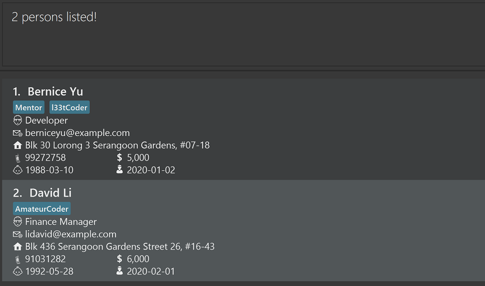

The Employee Tracker allows small business owners to keep track of their employees information using a single platform instead of having to deal with multiple data management tools.
Through a simple and intuitive graphical user interface, business owners can record and view their employees information.

* Table of Contents
{:toc}

--------------------------------------------------------------------------------------------------------------------

## Quick start

1. Ensure you have Java `11` or above installed in your Computer.
2. Download the latest `employeetracker.jar` [here](https://github.com/AY2021S2-TIC4002-F18-2/tp2/releases).
3. Copy `employeetracker.jar` to the folder you want to use as the home folder for Employee Tracker.
4. Double-click the file to start the app. The GUI similar to the one below should appear in a few seconds. Note that the app contains some sample data.
   
6. Type the command in the command box and press `Enter` to execute it.
    Some example commands you can try:
    - `add n/Rachel Lee r/Designer p/91648917 e/rachel@example.com a/BLK 730 Woodlands Road #15-150 b/1988-01-02 j/2020-09-01 s/8000 t/Founder t/l33tCoder`: Adds an employee record.
    - `list`: Lists all employee records.
    - `delete 3`: Deletes the 3rd employee record shown in the current list.
    - `sort n`: Sorts all employee records based on `Name` in alphabetical order.
    - `find n/Rachel`: Finds all employee records with `Rachel` in its `Name` field.
    - `stats`: Shows summary statistics of employees.
7. Refer to **Features** below for details of each command.

--------------------------------------------------------------------------------------------------------------------

## Features

**:information_source: Notes about the command format:** 

* Words in `UPPER_CASE` are the parameters to be supplied by the user. 
  E.g. The parameter `INDEX` in the command `delete INDEX`.

* Parameters in square brackets are optional.
  E.g. The parameter `[s/SALARY]` in `edit INDEX [n/NAME] [r/ROLE] [p/PHONE_NUMBER] [e/EMAIL] [a/ADDRESS] [b/DATE_OF_BIRTH] [j/DATE_OF_JOINING] [s/SALARY] [t/TAG]…`
  
* Parameters with `…` after them can be included multiple times. 
  E.g. The parameter `KEYWORD` in the command `find TYPE/KEYWORD…`.

* Parameters can be in any order. 
  E.g. The command `add` requires a few parameters such as `n/NAME`, `e/EMAIL` and `r/ROLE`. Placing these parameters in any order is acceptable.

* If a parameter is expected only once in the command but is specified multiple times, only the last occurrence of this parameter will be taken. 
  E.g. If `n/John Lam n/John Lee` is specified in the `add` command, only `n/John Lee` will be taken.

* Unneeded parameters for commands that do not take in parameters (such as `help`, `list`, `exit` , `stats` and `clear`) will be ignored. 
  E.g. The command `help 123` will be interpreted as `help`.

### Viewing help : `help`

Shows the URL of the user manual.

Format: `help`

### Adding an employee record : `add`

Adds an employee record to the Employee Tracker.

Format: `add n/NAME r/ROLE p/PHONE_NUMBER e/EMAIL a/ADDRESS b/DATE_OF_BIRTH j/DATE_OF_JOINING s/SALARY [t/TAG]…`
* `NAME` must only contain alphanumeric characters and spaces. E.g. `John Doe`.
* `PHONE_NUMBER` must be a number that is at least 3-digit long. E.g. `98714821`, `67617361`.
* `EMAIL` must be in local-part@domain format. E.g. `andy@example.com`.
* `DATE_OF_BIRTH` must be in yyyy-MM-dd format and must not be in the future. E.g. `1990-12-25`.
* `DATE_OF_JOINING` must be in yyyy-MM-dd format. E.g. `2020-09-01`.
* `SALARY` must be a positive integer. E.g. `4000`, `3000`.
* `TAG` must be alphanumeric. E.g. `Founder`, `l33tCoder`.

:bulb: **Note:**
All employee records must have a unique combination of name and date of birth.
A new employee record will not be added if there is an existing employee record with the same name and date of birth.

:bulb: **Tip:**
An employee record can have any number of tags (including 0).

Example of usage:
* `add n/Rachel Lee r/Designer p/91648917 e/rachel@example.com a/BLK 730 Woodlands Road #15-150 b/1988-01-02 j/2020-09-01 s/8000 t/Founder t/l33tCoder`

### Listing all employee records : `list`

Lists all the employee records in the Employee Tracker.

Format: `list`

### Editing an employee record : `edit`

Edits an employee record in the Employee Tracker.

Format: `edit INDEX [n/NAME] [r/ROLE] [p/PHONE_NUMBER] [e/EMAIL] [a/ADDRESS] [b/DATE_OF_BIRTH] [j/DATE_OF_JOINING] [s/SALARY] [t/TAG]…`
* `INDEX` refers to the index number shown in the list of employee records.
* `INDEX` must a positive integer. E.g. `1`, `2`, `3`…
* At least one of the optional parameters must be provided.
* The employee record indicated by the index number will be edited.
* `NAME` must only contain alphanumeric characters and spaces. E.g. `John Doe`.
* `PHONE_NUMBER` must be a number that is at least 3-digit long. E.g. `98714821`, `67617361`.
* `EMAIL` must be in local-part@domain format. E.g. `andy@example.com`.
* `DATE_OF_BIRTH` must be in yyyy-MM-dd format and must not be in the future. E.g. `1990-12-25`.
* `DATE_OF_JOINING` must be in yyyy-MM-dd format. E.g. `2020-09-01`.
* `SALARY` must be a positive integer. E.g. `4000`, `3000`.
* `TAG` must be alphanumeric. E.g. `Founder`, `l33tCoder`.
* All existing tags for this employee record will be removed if `TAG` is not provided in the `[t/TAG]` parameter. E.g. `edit 1 t/`.
* Editing tags will remove all existing tags for this employee record. E.g. If an employee record 1 has tags `Mentor` and `l33tCoder`, `edit 1 t/WiseGuy` will result in this employee record only having the tag `WiseGuy`.

Example of usage:
* `edit 1 p/91821748 s/9000 t/Mentor t/l33tCoder`

### Deleting an employee record : `delete`

Deletes the specified employee from the Employee Tracker.

Format: `delete INDEX`
* `INDEX` refers to the index number shown in the list of employee records.
* `INDEX` must a positive integer. E.g. `1`, `2`, `3`…
* The employee record indicated by the index number will be deleted.

Examples of usage:
* `list` followed by `delete 2` deletes the 2nd employee record shown in the list of employee records.

* `find n/Rachel` followed by `delete 1` deletes the 1st employee record in the list generated by the `find` command.

### Sorting employee records : `sort`
Sorts the list of employee records in the Employee Tracker.

Format: `sort TYPE`
* `TYPE` must be the letter `n`, `s`, `j` or `b`.
* If `TYPE` is n, the employee records will be sorted based on name in alphabetical order.
* If `TYPE` is s, the employee records will be sorted based on salary in increasing order.
* If `TYPE` is j, the employee records will be sorted based on date of joining from the earliest date to the latest date.
* If `TYPE` is b, the employee records will be sorted based on date of birth from the earliest date to the latest date.
* The `TYPE` is case-insensitive. E.g. sort type `N` will match `n`.

Example of usage:
* `sort n`

### Finding employee records : `find`

Finds employee records that have any of the given keywords in their name/role/address/date of birth/phone number.

Format: `find TYPE/KEYWORD…`
* `TYPE` must be the letter `n`, `r`, `a`, `b` or `p`.
* If `TYPE` is `n`, the search will be based on name.
* If `TYPE` is `r`, the search will be based on role.
* If `TYPE` is `a`, the search will be based on address.
* If `TYPE` is `b`, the search will be based on date of birth.
* If `TYPE` is `p`, the search will be based on phone number.
* The search is case-insensitive. E.g. keyword `john` will match `John`.
* Only exact words will be matched. E.g. keyword `Joh` will not match `John`.
* Exception for the phone number search: it allows a partial match of value at least 3 digits long.
* Employee records matching at least one keyword will be returned. E.g. keywords `John Wong` will return `John Lam` and `Bernice Wong`.

Example of usage:
* `find n/David Bernice`
  

### Clearing all employee records : `clear`

Clears all employee records from the Employee Tracker.

Format: `clear`

### Viewing summary statistics : `stats`

Shows summary statistics of employees including:
* Total employees.
* Total salary.
* Highest, lowest and average salary.
* Longest, shortest and average tenure.

Format: `stats`

### Exiting the program : `exit`

Exits the Employee Tracker app.

Format: `exit`

### Saving the data

There is no save command because any change to the data in the Employee Tracker will be automatically saved.

--------------------------------------------------------------------------------------------------------------------

## FAQ

**Q**:
How do I transfer my data to another computer?

**A**:
Go to the Employee Tracker's root folder in the current computer.
Copy the data folder and paste it into the Employee Tracker's root folder in the new computer.
Click `Yes` if the system prompts you for confirmation of overwriting.

--------------------------------------------------------------------------------------------------------------------

## Command summary

Action | Format, Examples
--------|------------------
**Help** | `help`
**Add** | `add n/NAME r/ROLE p/PHONE_NUMBER e/EMAIL a/ADDRESS b/DATE_OF_BIRTH j/DATE_OF_JOINING s/SALARY [t/TAG]…`   E.g. `add n/Rachel Lee r/Designer p/91648917 e/rachel@example.com a/BLK 730 Woodlands Road #15-150 b/1988-01-02 j/2020-09-01 s/8000 t/Founder t/l33tCoder`
**List** | `list`
**Edit** | `edit INDEX [n/NAME] [r/ROLE] [p/PHONE_NUMBER] [e/EMAIL] [a/ADDRESS] [b/DATE_OF_BIRTH] [j/DATE_OF_JOINING] [s/SALARY] [t/TAG]…`   E.g. `edit 1 p/91821748 s/9000 t/Mentor t/l33tCoder`
**Delete** | `delete INDEX`  E.g. `delete 2`
**Sort** | `sort TYPE`   E.g. `sort n`
**Find** | `find TYPE/KEYWORD`  E.g. `find n/David Bernice`, `find r/Developer`, `find a/Serangoon`, `find b/1992-05-28`, `find p/910`
**Stats** | `stats`
**Clear** | `clear`
