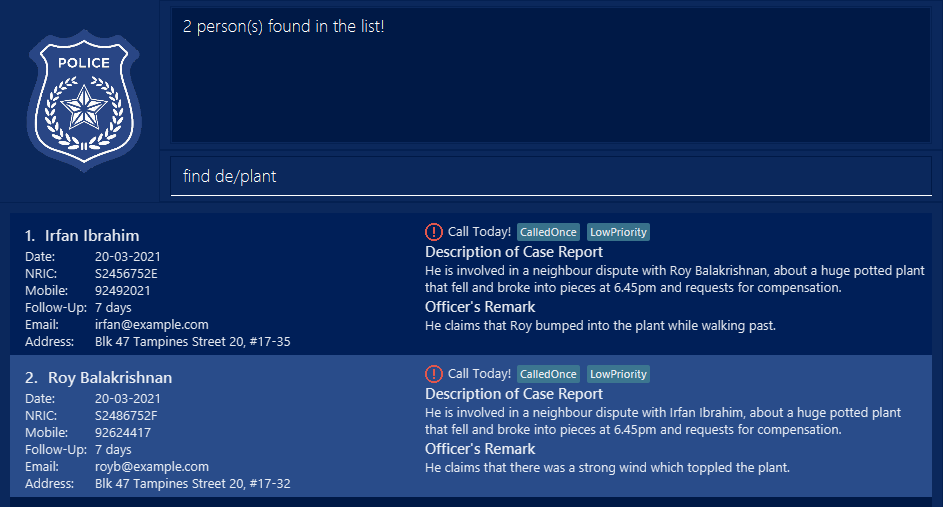

**Police Address Book (PAB)** is a desktop app meant for Police Investigation Officers, optimized for use via a Command Line Interface (CLI) with a Graphical User Interface (GUI).

It is designed to help them manage their investigation cases better by reminding them on which people to call, automatically rescheduling follow-up calls and assisting in sending case detail emails to colleagues or call notification emails to people in the contact list.

* Table of Contents
  {:toc}

--------------------------------------------------------------------------------------------------------------------

## Quick start

1. Ensure you have Java `11` or above installed in your Computer.

1. Download the latest `TIC4002-F18-1.PoliceAddressBook.jar` [here](https://github.com/AY2021S2-TIC4002-F18-1/tp2/releases/tag/v1.4).

1. Copy the file to the folder you want to use as the _home folder_ for your Police Address Book.

1. Double-click the file to start the app. The GUI similar to the below should appear in a few seconds. Notice that the app contains some sample data. 
   

1. Type the command in the command box and press Enter to execute it. e.g. typing **`help`** and pressing Enter will open the help window. 
   Some example commands you can try:

    * **`list`** : Lists all contacts.
    
    * **`find`** `John`:Find the person with the specific name in the current list.

    * **`delete`**`3` : Deletes the 3rd contact shown in the current list.

    * **`exit`** : Exits the app.

1. Refer to the [Features](#features) below for details of each command.

--------------------------------------------------------------------------------------------------------------------

## Features

**:information_source: Notes about the command format:** 

* Words in `UPPER_CASE` are the parameters to be supplied by the user. 
  e.g. in `add n/NAME`, `NAME` is a parameter which can be used as `add n/John Doe`.

* Items in square brackets are optional. 
  e.g. `n/NAME [t/TAG]` can be used as `n/John Doe t/friend` or as `n/John Doe`.

* Items with `…`​ after them can be used multiple times including zero times. 
  e.g. `[t/TAG]…​` can be used as ` ` (i.e. 0 times), `t/friend`, `t/friend t/family` etc.

* Parameters can be in any order. 
  e.g. if the command specifies `n/NAME p/PHONE_NUMBER`, `p/PHONE_NUMBER n/NAME` is also acceptable.

* If a parameter is expected only once in the command, but you specified it multiple times, only the last occurrence of the parameter will be taken. 
  e.g. if you specify `p/12341234 p/56785678`, only `p/56785678` will be taken.

* Extraneous parameters for commands that do not take in parameters (such as `help`, `list`, `exit` and `clear`) will be ignored. 
  e.g. if the command specifies `help 123`, it will be interpreted as `help`.
 
* Date format should be `dd-mm-yyyy`, other date format will not be accepted.
  e.g. `23-02-2021` is a valid date format, `Feb-23-2021` or `02-23-2021` is an invalid date format. 
  
* Date should be a valid calendar date, date out of range will not be accepted.
  e.g. `23-02-2021` is a valid calendar date, `33-02-2021` is an invalid date format. 
  
* NRIC format should be `1 capital letter that start with S, T, F or G,followed by 7 numerical numbers and a capital letter with alphanumeric characters . It should not be blank.`, other NRIC format will not be accepted.
    e.g. `S1234567B` is a valid NRIC format, `s2222b` or `s11111111` is an invalid NRIC format. 
  
* Phone numbers should only contain numbers, and it should be 3-15 digits long.
  
* Every person must contain a unique NRIC, phone number or email.
 

### Viewing help : `help`

Shows a message explaining how to access the help page.

Format: `help`

### Adding a person: `add`

Adds a person to the address book.

Format: `add n/NAME d/DATE f/FOLLOWUP i/NRIC p/PHONE_NUMBER e/EMAIL a/ADDRESS de/DESCRIPTION [r/REMARK] [t/TAG]…​`

:bulb: **Tip:**
A person can have any number of tags (including 0)

Examples:

* `add n/John Doe d/22-02-2021 f/7 i/S2731125H p/98765432 e/johnd@example.com a/311, Clementi Ave 2, #02-25 de/This man is a construction site manager who flew a drone over the Istana, beyond the boundary of his nearby work site, at 8.35am. r/He could be just curious to see what the Istana looks like. t/NeverCalled t/HighPriority`
* `add n/Betsy Crowe d/12-03-2021 f/14 i/S1234567A p/91234567 e/betsycrowe@example.com a/Blk 415 Woodlands Street 41, #17-35 de/She was molested by a Senior Investigations Officer at the Jurong Police Division Headquarters in the interview room around 9.00pm. r/She informed a policeman at the Police Cantonment Complex 5 days later. t/NeverCalled t/MediumPriority`

### Adding a remark: `remark`
Add remark to a person in the address book.

Format `remark INDEX r/REMARK`

:bulb: **Tip:**
* Add remark at the specified `INDEX`. The index refers to the index number shown in the displayed person list. The index **must be a positive integer** 1, 2, 3, …​

* You can clear the remark by not typing the prefix `r/` or leaving the remark in `r/` blank.

Examples:

* `remark 1 r/He works from 8.30am to 5.30pm. I have to call after working hours.`
* `remark 1` clears the existing remark from the person at index 1.
* `remark 1 r/` also clears the existing remark from the person at index 1.

### Editing a followUp: `followUp`
Edits number of days for recursive follow-up calls with the person.

Format `followUp INDEX f/FOLLOWUP`

* A red exclamation icon will appear with a "Call Today!" message when the last day of the follow-up date is the same as today.
* You can stop the follow-up by setting it to 0.
* The follow-up days must be between 0 and 365;

Examples:

* `followUp 2 f/3`
* `followUp 1 f/0`

### Listing all persons : `list`

Shows a list of all persons in the address book.

Format: `list`

### Editing a person : `edit`

Edits an existing person in the address book.

Format: `edit INDEX [n/NAME] [d/DATE] [i/NRIC] [p/PHONE] [e/EMAIL] [a/ADDRESS] [de/DESCRIPTION] [r/REMARK] [f/FOLLOWUP] [t/TAG]…​`

* Edits the person at the specified `INDEX`. The index refers to the index number shown in the displayed person list. The index **must be a positive integer** 1, 2, 3, …​
* At least one of the optional fields must be provided.
* Existing values will be updated to the input values.
* When editing tags, the existing tags of the person will be removed i.e. adding of tags is not cumulative.
* You can remove all the person’s tags by typing `t/` without specifying any tags after it.
* You can remove the remark by typing `r/` without specifying any remark after it.

Examples:
*  `edit 1 p/91234567 i/S1111112B e/johndoe@example.com` Edits the phone number,NRIC, email address of the 1st person to be `91234567`, ` i/S1111112B` and johndoe@example.com` respectively.
*  `edit 2 n/Betsy Crower t/` Edits the name of the 2nd person to be `Betsy Crower` and clears all existing tags.
*  `edit 2 n/Betsy Lim d/10-10-2021` Edits the name of the 2nd person to be `Betsy Lim` and edit the date as well.
*  `edit 1 r/` clears the existing remark from the person at index 1.

### Add a new tag : `addTag`

To add a new tag to the existing tags  

Format: `addTag INDEX at/TAG`

* Add new tag at the specified `INDEX`. The index refers to the index number shown in the displayed person list. The index **must be a positive integer** 1, 2, 3, …​
* New tag name should be entered after 'at/' only.
* Tag name cannot be empty and should not contain space in between.
* Only one tag is allowed to be added each time.

Examples:
*  `addTag 1 at/CalledTwice` Adds the tag CalledTwice to the person at index 1.
*  `addTag 2 at/Closed` Adds the tag Closed to the person at index 2.

### Remove an existing tag : `removeTag`

To remove a tag from the existing tags without overwritten all the tags 

Format: `removeTag INDEX rt/TAG`

* Add new tag at the specified `INDEX`. The index refers to the index number shown in the displayed person list. The index **must be a positive integer** 1, 2, 3, …​
* Tag to be removed should be entered after 'rt/' only.
* Tag name cannot be empty and should not contain space in between.
* Only one tag is allowed to be removed each time.

Examples:
*  `removeTag 1 rt/CalledTwice` Removes the tag CalledTwice from the person at index 1.
*  `removeTag 2 rt/Closed` Removes the tag Closed from the person at index 2.
*  
### Locating persons by name: `find`

Finds all fields contain any of the given keywords.

Format: 
`find KEYWORD` 
`find [n/MORE_KEYWORDS] [d/DATE] [i/NRIC] [p/PHONE] [e/EMAIL] [a/ADDRESS] [de/DESCRIPTION] [r/REMARK] [t/TAG]…`

* The search is case-insensitive. e.g. `n/hans` will match `Hans`
* The order of the keywords does not matter. e.g. `n\Hans` will match `Bo Hans`
* The search applies on all the fields.
* The default find command is finding the name field: e.g. `find john`
* Only find one filed at a time. Multiple find input is not supported. `find n\john`

Examples:
* `find n/alex bernice` returns `Alex Yeoh`, `Bernice Yu` 
* `find d/-02-` returns `Bernice Yu`, `Charlotte Oliveiro`
* `find f/7` returns `Alex Yeoh`, `Irfan Ibrahim`, `Roy Balakrishnan`
* `find i/567` returns `Alex Yeoh`, `Charlotte Oliveiro`, `Irfan Ibrahim`
* `find p/321` returns `Charlotte Oliveiro`
* `find a/tampines serangoon` returns `Bernice Yu`, `Irfan Ibrahim`, `Roy Balakrishnan`
* `find r/police` returns `Bernice Yu`
* `find t/lowPriority` returns `Charlotte Oliveiro`, `Irfan Ibrahim`, `Roy Balakrishnan`
* `find t/never` returns `Bernice Yu`, `Charlotte Oliveiro`
* `find de/plant` returns `Irfan Ibrahim`, `Roy Balakrishnan`
  

### Deleting a person : `delete`

Deletes the specified person from the Police Address Book.

Format: `delete INDEX`

* Deletes the person at the specified `INDEX`.
* The index refers to the index number shown in the displayed person list.
* The index **must be a positive integer** 1, 2, 3, …​

Examples:
* `list` followed by `delete 2` deletes the 2nd person in the Police Address Book.
* `find Betsy` followed by `delete 1` deletes the 1st person in the results of the `find` command.

### Clearing all entries : `clear`

Clears all entries from the Police Address Book.

Format: `clear`

### Sending email : `send`

sending email to user.

Format: 
`send INDEX e/EMAIL` 
`send INDEX MESSAGE`
        
* The email format will be validated.
* The index must be numeric and within the list size.
* Any email address with empty space after e\ will treat as invalid email.
* Any empty space between email format will be regarded as a MESSAGE.

Examples:
* `send 1 e/hellokitty@hotmail.com` sending the first data in the printed list to the user.
* `send 1 I am not able to contact you, please call me` the message will send to the reporter's email address in the list number 1.

### Exiting the program : `exit`

Exits the program.

Format: `exit`

### Saving the data

Police Address Book data are saved in the hard disk automatically after any command that changes the data. There is no need to save manually.

### Editing the data file

Police Address Book data are saved as a JSON file `[JAR file location]/data/addressbook.json`. Advanced users are welcome to update data directly by editing that data file.

:exclamation: **Caution:**
If your changes to the data file makes its format invalid, Police Address Book will discard all data and start with an empty data file at the next run.

--------------------------------------------------------------------------------------------------------------------

## FAQ

**Q**: How do I transfer my data to another Computer? 
**A**: Install the app in the other computer and overwrite the empty data file it creates with the file that contains the data of your previous Police Address Book home folder.

--------------------------------------------------------------------------------------------------------------------

## Command summary

Action | Format, Examples
--------|------------------
**Add** | `add n/NAME d/DATE i/NRIC p/PHONE_NUMBER e/EMAIL a/ADDRESS r/REMARK [t/TAG]…​`   e.g., `add n/James Ho d/20-12-2012 f/3 i/S1234567Z p/82224444 e/jamesho@example.com a/123, Clementi Rd, 1234665 de/This man is a construction site manager who flew a drone over the Istana, beyond the boundary of his nearby work site, at 8.35am. r/He could be just curious to see what the Istana looks like. t/NeverCalled t/HighPriority`
**Clear** | `clear`
**Delete** | `delete INDEX`  e.g., `delete 3`
**Edit** | `edit INDEX [n/NAME] [d/DATE] [i/NRIC] [p/PHONE_NUMBER] [e/EMAIL] [a/ADDRESS] [de/DESCRIPTION] [r/REMARK] [t/TAG]…​`  e.g.,`edit 2 n/James Lee e/jameslee@example.com`
**Find** | `find KEYWORD [n/MORE_KEYWORDS][d/DATE] [i/NRIC] [p/PHONE_NUMBER] [e/EMAIL] [a/ADDRESS] [de/DESCRIPTION] [r/REMARK]  [t/TAG]…`  e.g., `find n/James`
**List** | `list`
**Help** | `help`
**Remark** | `remark INDEX r/REMARK`  e.g., `remark 1 r/He works from 8.30am to 5.30pm. I have to call after working hours.`
**FollowUp** | `followUp INDEX f/FOLLOWUP`  e.g., `followUp 2 f/3`
**send** | `send INDEX e/EMAIL OR send INDEX MESSAGE`  e.g., `send 1 e/hellokitty@hotmail.com OR send 1 I am not able to contact you, please call me`
**Add Tag** | `addTag INDEX at/TAG`  e.g., `addTag 1 at/CalledOnce`
**Remove Tag** | `removeTag INDEX rt/TAG`  e.g., `removeTag 1 rt/CalledOnce`
